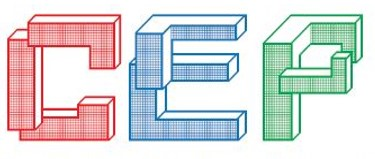
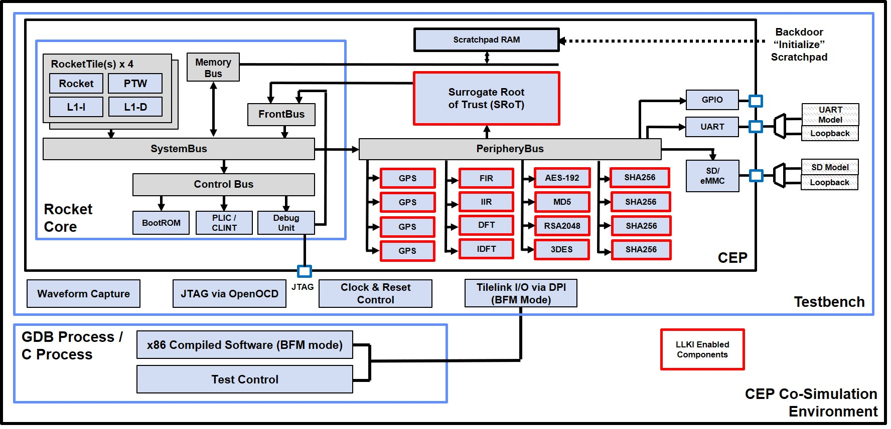

[//]: # (Copyright 2024 Massachusetts Institute of Technology)
[//]: # (SPDX short identifier: BSD-3-Clause)

# Common Evaluation Platform v4.6

[](https://zenodo.org/badge/latestdoi/108179132)
[](https://opensource.org/licenses/BSD-3-Clause)

<p align="center">
    
</p>
<p align="center">
   Copyright 2024 Massachusetts Institute of Technology
</p>
<p align="center">
   
</p>
<p align="center">
    
</p>

The Common Evaluation Platform (CEP) is an SoC design that contains only license-unencumbered, freely available components.  The CEP includes a range of accelerator cores coupled with a key delivery mechanism, and parametrically-defined challenge modules which can be synthesized to support developmental testing. The implementation of the CEP includes a comprehensive verification environment to ensure modifications do not impede intended functionality. It is intended to be targeted to either an FPGA or ASIC implementation. 

Please check the [CEP changelog](./CHANGELOG.CEP.md) for release history.

Beginning with CEP v4.0, the platform has been ported to the UCB Chipyard Framework.  The original Chipyard Readme can be found [here](./README.Chipyard.md).

Throughout the CEP READMEs, `<CEP_ROOT>` refers to the root directory of the cloned CEP repository.

## Pre-requisites (validated test/build configurations):
The following items describe the configuration of the system that CEP has been developed and tested on:
* Ubuntu 18.04 or 22.04 LTS x86_64 with Modelsim Questa Sim-64 v2019.1+ (for co-simulation)
* (DEPRECATED) Red Hat Enterprise Linux 7 with Cadence XCELIUMAGILE20.09.001, VMANAGERAGILE20.06.001.  RHEL8 support pennding
* Xilinx Vivado 2020.1 (needed for building FPGA targets)
  - Plus Digilent Adept Drivers for programming the FPGA target, https://reference.digilentinc.com/reference/software/adept/start?redirect=1#software_downloads)
  - *Note*: The sifive tcl scripts for running vivado are not currently compatible with later Vivado versions (2021.1 and 2022.1 tested)
* Terminal emulator (such as `minicom` or `screen`)
* bash

Other configurations/versions may work, but they have not been explicitly verified.

Instructions on how to modelsim, xcelium, and Vivado are beyond the scope of this README.

## Setting up your environment

First, the following items should be considered:
* Proxies: If your system is behind a proxy, you'll want to ensure your environment is properly configured.  Exact details vary by system, but the proxy needs to be available to apt / yum, curl, conda, etc.

* Ubuntu: Install `libcrypto++-dev`.  On 22.04, `libncurses5` will also be required to run Vivado 2020.1

* RHEL8:
  The following packages are required beyond the default RHEL8 install `sudo dnf install make git gcc-toolset-13-gcc-c++-13.1.1-4.3.el8.x86_64`

  Additionally, even though the Cadence `checkSysConf` doesn't report it, you'll need to `sudo dnf install glibc.i686`

  SELinux can interfere with the CEP CoSimulation.  Either it should be set to permissive or more carefully crafted rules would need to be crafted.

  Libcrytpo++ will need to be built from source.  It can be downloaded from [here](https://www.cryptopp.com).  It is receommended you select a version >= 8.6.
  The following commands allow you to build libcrypto++ : `make; sudo make install`

It is recommended you follow the setup documentation provided by [Chipyard](https://chipyard.readthedocs.io/en/latest/Chipyard-Basics/Initial-Repo-Setup.html#prerequisites).  This includes conda installation and submodule initialization.  Note the dependency on a specific version of conda-lock.

Following the installation of conda, it is recommended you execute the following commands
```
  conda config --set auto_activate_base false                   <-- don't automatically run the base environent upon execution of .bashrc
  conda init bash                                               <-- Be sure bash is correctly configured with conda (other base environ deactivation will hang)  
```

## Repository Directory Structure
Providing a complete directory structure is impractical, but some items are highlighted here.  It is worth noting that most of the structure is inherited from Chipyard.

```
<CEP_ROOT> 
  |- ./sims/cep_cosim/ -  
  |     Defines the CEP co-simulation evironment for performing "chip" level simulations of the CEP in 
  |     either bare metal or bus functional model (BFM) mode.  
  |- ./generators/mitll-blocks/
  |   |- src/main/scala - Contains all the custom CEP Chisel code
  |   |- src/main/resources/vsrc/ - SystemVerilog / Verilog files associated with the CEP build
  |       |- opentitan  - Soft-link to the opentitan submodule located at ./opentitan
  |       |- aeees      - Challenge module.  Read the README.md in this directory for more information.
  |       |- auto-fir   - Challenge module.  Read the README.md in this directory for more information.
  |       |- shaaa      - Challenge module.  Read the README.md in this directory for more information.
  |- ./cep_docs - Documents and images unique to the CEP
  |- ./software/baremetal - Examples of bare metal code that can be run on the Arty100T FPGA target
                            independent of the CEP Co-Simulation environment
```

### Building the CEP FPGA
Begin by initializing the fpga-shells submodule: `<CEP_ROOT>/scripts/init_fpga.sh`.

Multiple Chipyard *SUB_PROJECTS* have been defined for the CEP when targetting FPGA Development boards.  All of these have been verified to boot linux.

These subprojects define the system configuration and are as follows:

`cep_arty100t` - Arty100T Development Board 
- 50 MHz Core Frequency
- 78% LUT Utilization
- 1x WithNBigCore
- CEP Registers
- MD5 Core
- Surrogate Root of Trust (SRoT)

`cep_vc707` - VC707 Development Board
- 75 MHz Core Frequency
- 75% LUT Utilization
- 4x WithNBigCores
- CEP Registers
- AES Core
- DES3 Core
- FIR Core
- IIR Core
- DFT Core
- IDFT Core
- MD5 Core
- 4x GPS Cores
- 4x SHA-256 Cores
- RSA Core
- Surrogate Root of Trust

`cep_vcu118` - 
- TBD

In order to target the Arty100T, the Digilent vivado-boards support needs to be installed.  Instructions can be found [here](https://digilent.com/reference/programmable-logic/guides/installing-vivado-and-vitis).

Assuming the Vivado environment scripts have been sourced within your current shell, the following commands can be used to build and program the FPGA *SUB_PROJECT*.  Programming requires that the digilent drivers have been installed and that you have a USB connection to the JTAG USB-port of you preffered FPGA board.

Default CEP builds can be customized by following the instructions in the Chipyard documentation.

The FPGA boards will configure from FLASH or JTAG based on the state of the MODE jumper.  Additional information can be found:
* Arty100T - [here](https://digilent.com/shop/arty-a7-artix-7-fpga-development-board/).
* VC707    - [here](https://www.xilinx.com/products/boards-and-kits/ek-v7-vc707-g.html/).
* VCU118   - [here](https://www.xilinx.com/products/boards-and-kits/vcu118.html/).

```
cd <REPO_ROOT>/fpga
make SUB_PROJECT=<cep_arty100t | cep_vc707 | cep_vcu118>

./program_<arty100t | vc707 | vcu118>_flash.sh - Create the MCS file & program the development board's flash.  Power needs to be cycled or the *PROG* button needs to be asserted to reboot with the new configuration.

OR

./program_<arty100t | vc707 | vcu118>_jtag.sh - Program the FPGA via JTAG.  System will automatically reset or you can use the *RESET* button.
```

### Building Bare Metal software for the CEP FPGA

The Arty100T shares a single microUSB connector for JTAG and UART, while the VC707 and VCU118 have seperate ports for each.

For the Arty100T, connect a Digilent SD or microSD PMOD board o connector JA.  For the VCU118, connect the same to the PMOD connector on the right side of the board.  The PMOD connectors can be ordered from Digikey, Digilent, or other distributors.

Additional information can be found here: (https://digilent.com/shop/pmod-sd-full-sized-sd-card-slot/ or https://digilent.com/shop/pmod-microsd-microsd-card-slot/).

As noted, for the Arty100T the microUSB port uses an FTDI chip to provide both JTAG and UART functionality.  Your system may differ, but typically the UART shows up as `/dev/ttyUSB0` or `/dev/ttyUSB1`.  UART settings are 115200baud, 8N1 and should be visible to any terminal program.  Both HW and SW flow control should be disabled.  

It is worth noting that *minicom* enables HW flow control by default.

Once released from reset, the CEP's bootrom will read the baremetal executable from the SD card, copy it DDR memory, and then jump to that location and execute the program.  The bootrom's default payload size is large enough for a linux boot.  For bare metal executables, the payloads are typically much smaller.  The payload size can be overriden at boot time by holding *BTN0* on the Arty100T or *SWN* on the VC707/VCU118 when the chip is released from reset.

An example UART output for the baremetal gpiotest follows:
```
---          Common Evaluation Platform v4.50            ---
--- Based on the UCB Chipyard Framework (1.10.0 release) ---
--- Copyright 2024 Massachusetts Institute of Technology ---
---     BootRom Image built on Dec  4 2023 10:15:50      ---

INIT
CMD0
CMD8
ACMD41
CMD58
CMD16
CMD18
LOADING 128kB PAYLOAD
....

--------------------------
     RISC-V GPIO Test     
--------------------------
     Built for VCU118
   Console Echo Enabled   


gpio = 00000010
gpio = 00000000
gpio = 00000020
gpio = 00000000
gpio = 00000080
gpio = 00000000
gpio = 00000040
gpio = 00000000
...
```

A developer may use baremetal software from the CEP cosimulation or the examples as provided in `<CEP_ROOT>/software/baremetal`.  

The (micro)SD card needs to be partitioned as described in (https://chipyard.readthedocs.io/en/latest/Prototyping/VCU118.html#running-linux-on-vcu118-designs).  Once partitioned, proceed to the next step.

In either case, it is important to note what device your (micro)SD card gets mapped to (e.g., `/dev/sdd`).

Using `<CEP_ROOT>/sims/cep_cosim/testSuites/bareMetalTests/regTest` as an example, the following steps will build and load the executable onto the (micro)SD card.

```
cd <CEP_ROOT>/sims/cep_cosim/testSuites/bareMetal/regTest
make BAREMETAL_PRINTF=kputc DISK=/dev/sdd1 riscv_wrapper_sd_write       <-- builds code with console enabled and copies image to your SD card
```

In the above example, the bare metal regTest is built with the console printf function enabled.

The steps in `<CEP_ROOT>/software/baremetal/gpiotest` are slight different.

```
cd <CEP_ROOT>/software/baremetal/gpiotest
make BOARD=<arty_a7_100 | vc707 | vcu118> DISK=/dev/sdd1 sd_write     <-- Builds for the selected board and copies gpiotest.img to partition /dev/sdd1 (subsitute with your device name)
```

It is worth noting that the examples in `<CEP_ROOT>/software/baremetal` do not require the compilation of the all the cosimulation libraries, but as a result, will not have access to those support functions.

### FPGA Fast-Boot
When booting bare metal software, it is useful to not have to wait for the bootrom to load a linux-sized payload.  When powering the FPGA board, a *fast-boot* can be enabled by holding BTN N on the VC707/VCU118 or BTN0 on the Arty100T.

### Booting Linux
The CEP Arty100T/VC707/VCU118 builds has been verified to support a firemarshall-based linux build by following the default workload instructions [here](https://chipyard.readthedocs.io/en/latest/Prototyping/VCU118.html#running-linux-on-vcu118-designs).

A couple of notes:
- The SD card must be partitioned as instructed
- Due to a bug in libguestfs on Ubuntu, the firemarshal build *may* fail.  Ensure your current shell has active sudo permissions before running the build.  I used a quick `sudo su`, exited the root shell, and then ran the build.
- Customization of the linux build will affect the resulting image size `<CEP_ROOT>/software/firemarshal/images/br-base-bin-nodisk-flat`.  Ensure that `PAYLOAD_SIZE_B` in `<CEP_ROOT>/sims/cep_cosim/bootrom/sd.c` is sized to accomodated the image.

### Linux Applications
You can install an example application in firemarshal's buildroot prior to building linux by running `make MAINPROGRAM=<prog name> install` from <CEP_ROOT>/software/linux.  Applications include `helloworld` and `gpiotest`. 

It is advisable to clean the buildroot build, should you change the configuration.  This can accomplished by running `make clean` within `<CEP_ROOT>/software/firemarshal/boards/prototype/distros/br/buildroot/`.

If you ncurses-based gpiotest application crashes before cleanup, executing the `reset` command should restore terminal behavior.

### CEP Co-Simulation using QuestaSim or XCellium
For simulation using the CEP Co-Simulation environment, the `cep_cosim` and `cep_cosim_asic` *SUB_PROJECTS* are defined in `<CEP_ROOT>/variables.mk`.  At this time, due to licensing constraints, the CEP ASIC build is not available as part of this repository.  As a result, any attempt to build it will fail given that a multitude of files are missing.  

Instructions on the CEP Co-Simulation (including the Chipyard build) can be found [here](./sims/cep_cosim/README.md).

### Chipyard-based simulation using Verilator

The cosimulation bare metal tests can be run on Verilator.

Begin by building the Verilator executable:
```
cd <CEP_ROOT>/sims/verilator
make SUB_PROJECT=cep_verilator
```

Once the verilator executable is built, code can be run using the following as an example:

`./simulator-chipyard-CEPVerilatorRocketConfig ../../sims/cep_cosim/testSuites/bareMetalTests/regTest/riscv_wrapper.elf +loadmem=../../sims/cep_cosim/testSuites/bareMetalTests/regTest/riscv_wrapper.hex +loadmem_addr=80000000`


The `+loadmem` and `+loadmem_addr` parameters support the fast loading of the executable, as described [here](https://chipyard.readthedocs.io/en/latest/Simulation/Software-RTL-Simulation.html#verilator-open-source).  Scroll down to Section 2.1.7.

Is this case, the Co-simulation's bare metal register test has previously be built using the following commands:

```
cd <CEP_ROOT>/sims/cep_cosim/testSuites/bareMetal/regTest
make clean; make BAREMETAL_PRINTF=libgloss riscv_wrapper
```

The BAREMETAL_PRINTF=libgloss variable instructs the compiler to use libgloss / Host Target Interface for simplified printing through verilator.

### Generated DSP code notes
All the cores are now included in the CEP repository.  Instructions on generating all the cores can be found [here](./generators/mitll-blocks/src/main/resources/vsrc/dsp/README.md).

## Errors? Ommissions? Questions?
Please feel free to file a github issue which the CEP developers check frequently.

## Citation Information
Citation information is contained [here](./citation.cff)

## Licensing
As the CEP has been developed with input from many sources, multiple licenses apply.  Please refer to the following files for licensing info. 
* [CEP License](./LICENSE.md)
* [CEP Components Licenses](./LICENSE.Components.md)
* [Chipyard License](./LICENSE.Chipyard.md)
* [SiFive License](./LICENSE.SiFive.md)

## DISTRIBUTION STATEMENT A. Approved for public release. Distribution is unlimited.

© 2023 Massachusetts Institute of Technology
•   Subject to FAR 52.227-11 – Patent Rights – Ownership by the Contractor (May 2014)
•   SPDX-License-Identifier: BSD-3-Clause

This material is based upon work supported by the Defense Advanced Research Projects Agency under Air Force Contract No. FA8702-15-D-0001. Any opinions, findings, conclusions or recommendations expressed in this material are those of the author(s) and do not necessarily reflect the views of the Defense Advanced Research Projects Agency.

The software/firmware is provided to you on an As-Is basis
