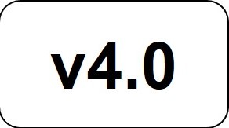

[//]: # (Copyright 2022 Massachusetts Institute of Technology)
[//]: # (SPDX short identifier: BSD-2-Clause)

# Common Evaluation Platform v4.0

    

    

   Copyright 2022 Massachusetts Institute of Technology

    

DISTRIBUTION STATEMENT C. Distribution authorized to U.S. Government Agencies and their contractors; Software and Documentation; (enter date approved by sponsor). Other requests for this software shall be referred to the Defense Advanced Research Projects Agency.

For questions about commercial license, reference MIT TLO Case number 24004L

WARNING: This document may contain technical data whose export is restricted by the Arms Export Control Act (AECA) or the Export Administration Act (EAA). Transfer of this data by any means to a non-US person who is not eligible to obtain export-controlled data is prohibited. By accepting this data, the consignee agrees to honor the requirements of the AECA and EAA. DESTRUCTION NOTICE: For unclassified, limited distribution documents, destroy by any method that will prevent disclosure of the contents or reconstruction of the document.

This material is based upon work supported by the Defense Advanced Research Projects Agency under Air Force Contract No. FA8702-15-D-0001. Any opinions, findings, conclusions or recommendations expressed in this material are those of the author(s) and do not necessarily reflect the views of the Defense Advanced Research Projects Agency.

Delivered to the U.S. Government with Unlimited Rights, as defined in DFARS Part 252.227-7013 or 7014 (Feb 2014). Notwithstanding any copyright notice, U.S. Government rights in this work are defined by DFARS 252.227-7013 or DFARS 252.227-7014 as detailed above. Use of this work other than as specifically authorized by the U.S. Government may violate any copyrights that exist in this work.

© 2022 Massachusetts Institute of Technology.
